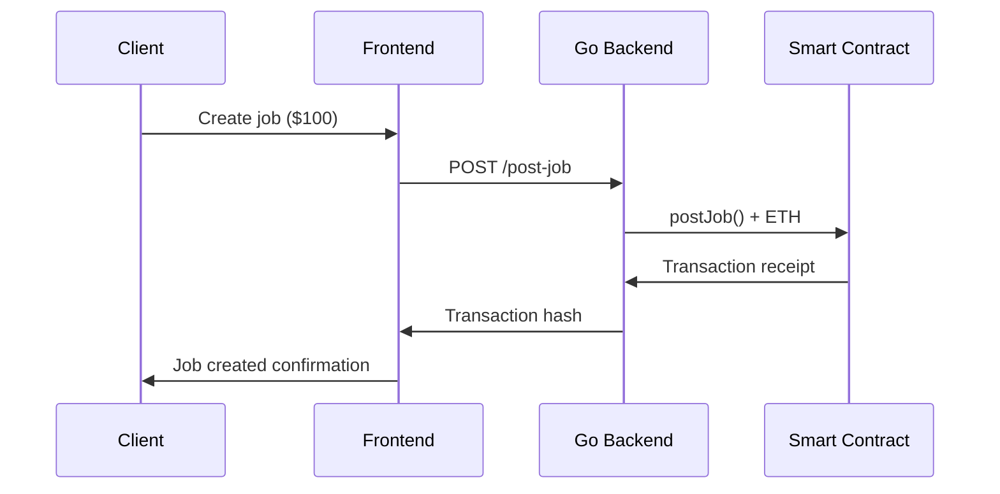
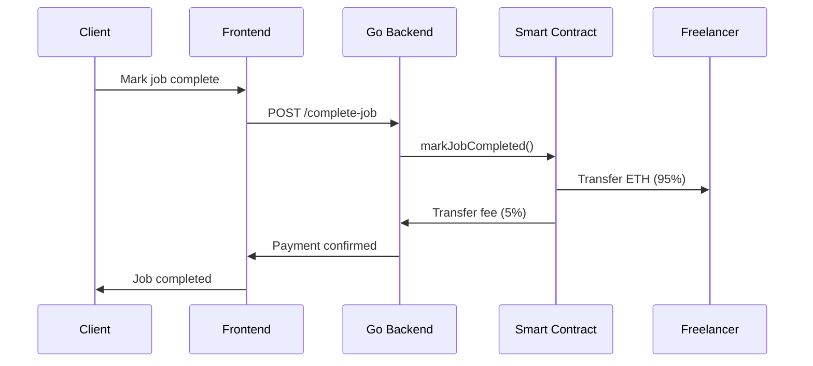

# Complete Integration Guide: Smart Contract ↔ Golang Web App

This guide provides a complete step-by-step process to integrate your Solidity smart contract with your Golang web application for blockchain-based freelance payments.

## 🎯 Integration Overview

Your `EthJobEscrow` smart contract handles:
- ✅ Escrow payments in ETH (priced in USD)
- ✅ Job lifecycle management (post → complete → pay)
- ✅ Chainlink price feeds for USD/ETH conversion
- ✅ 5% platform fee handling
- ✅ Job cancellation and refunds

The Golang integration provides:
- ✅ REST API for all contract operations
- ✅ Automatic gas management
- ✅ Transaction monitoring
- ✅ Error handling and validation
- ✅ Environment-based configuration

## 📋 Prerequisites Checklist

Before starting, ensure you have:

- [ ] **Go 1.19+** installed
- [ ] **Node.js & npm** (for Foundry)
- [ ] **Foundry** installed (`curl -L https://foundry.paradigm.xyz | bash`)
- [ ] **Ethereum testnet access** (Infura/Alchemy account)
- [ ] **Test ETH** in your wallet (from [Sepolia faucet](https://sepoliafaucet.com/))
- [ ] **Private key** of wallet with test ETH

## 🚀 Step-by-Step Integration

### Step 1: Environment Setup

```bash
# 1. Navigate to the Go integration directory
cd go-integration

# 2. Copy environment template
cp env.example .env

# 3. Edit .env file with your details
nano .env
```

**Required .env configuration:**
```env
ETHEREUM_RPC_URL=https://sepolia.infura.io/v3/YOUR_INFURA_PROJECT_ID
NETWORK_ID=11155111
PRIVATE_KEY=your_private_key_without_0x_prefix
# CONTRACT_ADDRESS will be set after deployment
```

### Step 2: Install Dependencies

```bash
# Install Go dependencies
go mod tidy

# Verify installation
make help
```

### Step 3: Deploy Smart Contract

```bash
# Set environment variables for deployment
export SEPOLIA_RPC_URL="https://sepolia.infura.io/v3/YOUR_PROJECT_ID"
export PRIVATE_KEY="your_private_key_without_0x"

# Deploy contract using the automated script
make deploy-contract
```

The script will:
- ✅ Compile your smart contract
- ✅ Deploy to Sepolia testnet
- ✅ Verify on Etherscan
- ✅ Update your `.env` file with contract address

### Step 4: Test the Integration

```bash
# Start the Go server
make run

# In another terminal, test the API
make test-api
```

### Step 5: Integrate with Your Web App

#### Option A: Use as Microservice (Recommended)

Keep the Go integration as a separate service and call it from your main web app:

```javascript
// From your frontend or backend
const response = await fetch('http://localhost:8080/post-job', {
  method: 'POST',
  headers: { 'Content-Type': 'application/json' },
  body: JSON.stringify({
    job_id: 123,
    freelancer_address: freelancerWallet,
    usd_amount: "100",
    client_address: clientWallet
  })
});
```

#### Option B: Import Go Package Directly

If your main app is also in Go:

```go
import (
    "github.com/fahedafzaal/freelance-payment-gateway/internal/config"
    "github.com/fahedafzaal/freelance-payment-gateway/pkg/blockchain"
)

// Initialize
cfg := config.Load()
client, err := blockchain.NewClient(cfg)

// Use in your handlers
result, err := client.PostJob(ctx, jobID, freelancerAddr, usdAmount, clientAddr)
```

## 🔄 Payment Flow Integration

### 1. Job Creation Flow



### 2. Job Completion Flow



## 🛠 API Integration Examples

### Frontend Integration (React/Vue/Angular)

```javascript
class PaymentGateway {
  constructor(baseUrl = 'http://localhost:8080') {
    this.baseUrl = baseUrl;
  }

  async postJob(jobData) {
    const response = await fetch(`${this.baseUrl}/post-job`, {
      method: 'POST',
      headers: { 'Content-Type': 'application/json' },
      body: JSON.stringify(jobData)
    });
    return response.json();
  }

  async getJobStatus(jobId) {
    const response = await fetch(`${this.baseUrl}/job-status?job_id=${jobId}`);
    return response.json();
  }

  async completeJob(jobId) {
    const response = await fetch(`${this.baseUrl}/complete-job?job_id=${jobId}`, {
      method: 'POST'
    });
    return response.json();
  }
}

// Usage
const gateway = new PaymentGateway();
const result = await gateway.postJob({
  job_id: 123,
  freelancer_address: "0x...",
  usd_amount: "100",
  client_address: "0x..."
});
```

### Backend Integration (Node.js/Python/PHP)

```javascript
// Node.js example
const axios = require('axios');

class BlockchainPayments {
  constructor() {
    this.gatewayUrl = 'http://localhost:8080';
  }

  async createEscrowPayment(jobId, freelancerAddress, usdAmount, clientAddress) {
    try {
      const response = await axios.post(`${this.gatewayUrl}/post-job`, {
        job_id: jobId,
        freelancer_address: freelancerAddress,
        usd_amount: usdAmount.toString(),
        client_address: clientAddress
      });
      
      return {
        success: true,
        txHash: response.data.tx_hash,
        blockNumber: response.data.block_number
      };
    } catch (error) {
      return {
        success: false,
        error: error.response?.data || error.message
      };
    }
  }
}
```

## 📊 Database Integration

### Job Status Synchronization

Consider creating database triggers or background jobs to sync blockchain state:

```go
// Example background sync job
func (s *Service) SyncJobStatus(jobID uint64) error {
    // Get current blockchain state
    details, err := s.blockchain.GetJobDetails(ctx, jobID)
    if err != nil {
        return err
    }
    
    // Update local database
    return s.db.UpdateJob(jobID, &models.Job{
        IsCompleted: details.IsCompleted,
        IsPaid:      details.IsPaid,
        ETHAmount:   details.ETHAmount.String(),
    })
}
```

### Recommended Database Schema

```sql
-- Add blockchain fields to your existing jobs table
ALTER TABLE jobs ADD COLUMN blockchain_job_id BIGINT;
ALTER TABLE jobs ADD COLUMN contract_address VARCHAR(42);
ALTER TABLE jobs ADD COLUMN tx_hash VARCHAR(66);
ALTER TABLE jobs ADD COLUMN eth_amount VARCHAR(32);
ALTER TABLE jobs ADD COLUMN is_blockchain_synced BOOLEAN DEFAULT FALSE;

-- Index for performance
CREATE INDEX idx_jobs_blockchain_id ON jobs(blockchain_job_id);
```

## 🔒 Security Best Practices

### 1. Private Key Management

**Never hardcode private keys!** Use environment variables or secure vaults:

```bash
# Development
export PRIVATE_KEY="your_key"

# Production - use AWS KMS, HashiCorp Vault, etc.
# The key should be encrypted and rotated regularly
```

### 2. Input Validation

```go
func validateJobRequest(req *PostJobRequest) error {
    if req.JobID == 0 {
        return errors.New("job_id is required")
    }
    if !common.IsHexAddress(req.Freelancer) {
        return errors.New("invalid freelancer address")
    }
    if !common.IsHexAddress(req.ClientAddr) {
        return errors.New("invalid client address")
    }
    usdAmount, ok := new(big.Int).SetString(req.USDAmount, 10)
    if !ok || usdAmount.Cmp(big.NewInt(0)) <= 0 {
        return errors.New("invalid USD amount")
    }
    return nil
}
```

### 3. Rate Limiting

```go
// Example rate limiting middleware
func rateLimitMiddleware(next http.Handler) http.Handler {
    limiter := rate.NewLimiter(10, 100) // 10 requests per second, burst of 100
    
    return http.HandlerFunc(func(w http.ResponseWriter, r *http.Request) {
        if !limiter.Allow() {
            http.Error(w, "Rate limit exceeded", http.StatusTooManyRequests)
            return
        }
        next.ServeHTTP(w, r)
    })
}
```

## 🚨 Troubleshooting

### Common Issues & Solutions

1. **"insufficient funds for gas"**
   - Ensure wallet has enough ETH for gas fees
   - Check current gas prices and adjust `GAS_PRICE` in .env

2. **"contract call reverted"**
   - Verify contract address is correct
   - Check if job ID already exists
   - Ensure USD amount is positive

3. **"connection refused"**
   - Verify Ethereum RPC URL is correct
   - Check if Infura/Alchemy project is active
   - Test with curl: `curl -X POST YOUR_RPC_URL`

4. **"nonce too low"**
   - Wait for previous transactions to confirm
   - Check pending transactions on Etherscan

### Debug Mode

Enable debug logging:
```go
import "log"

// In main.go
log.SetLevel(log.DebugLevel)
```

## 📈 Production Deployment

### 1. Infrastructure Setup

```yaml
# docker-compose.yml
version: '3.8'
services:
  payment-gateway:
    build: .
    ports:
      - "8080:8080"
    environment:
      - ETHEREUM_RPC_URL=${ETHEREUM_RPC_URL}
      - CONTRACT_ADDRESS=${CONTRACT_ADDRESS}
      - PRIVATE_KEY=${PRIVATE_KEY}
    restart: unless-stopped
    
  nginx:
    image: nginx:alpine
    ports:
      - "80:80"
      - "443:443"
    volumes:
      - ./nginx.conf:/etc/nginx/nginx.conf
    depends_on:
      - payment-gateway
```

### 2. Monitoring Setup

```go
// Add metrics collection
import "github.com/prometheus/client_golang/prometheus"

var (
    transactionTotal = prometheus.NewCounterVec(
        prometheus.CounterOpts{
            Name: "blockchain_transactions_total",
            Help: "Total number of blockchain transactions",
        },
        []string{"method", "status"},
    )
)
```

### 3. Backup Strategy

- **Hot wallet**: Keep minimal ETH for operations
- **Cold storage**: Store main funds securely
- **Key rotation**: Regular private key rotation
- **Monitoring**: Alert on unusual transaction patterns

## 🔗 Additional Resources

- [Ethereum JSON-RPC API](https://ethereum.org/en/developers/docs/apis/json-rpc/)
- [Go-Ethereum Documentation](https://geth.ethereum.org/docs/developers/dapp-developer/native-bindings)
- [Chainlink Price Feeds](https://docs.chain.link/data-feeds/price-feeds/)
- [Foundry Documentation](https://book.getfoundry.sh/)

## 🆘 Support

If you encounter issues:

1. Check the troubleshooting section above
2. Review logs for specific error messages
3. Test individual components (RPC connection, contract calls)
4. Verify all environment variables are set correctly

---

**🎉 Congratulations!** You now have a complete blockchain payment integration for your freelancing platform. Your smart contract is securely managing escrow payments while your Go backend provides a clean API for your web application. 